# Module 11 Challenge: Forecasting Net Prophet
### By: Yen

Contain a tool (forecasting_net_prophet.ipynb) that analyzes company stock price in correlation to search traffic, utilizes Prophet Forecast model to predict search traffic and display it visually. 

-  Data mine and display unusual patterns in hourly Google search traffic for a financial event such as Earning Call.                                                       
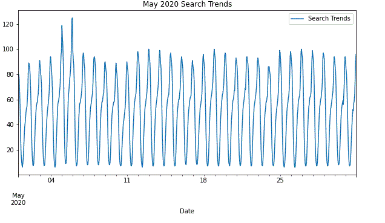

- Evaluate the search traffic data to determine seasonality for marketing department to incorporate in the marketing plan such as when to advertise to users.                                            
Average Traffic by Day of Week:                   
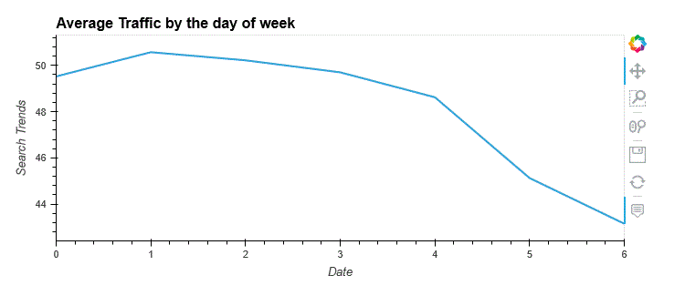
Heatmap:                                                 
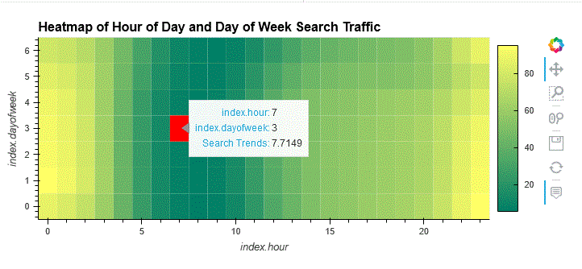     
Average Traffic by Week:                                     
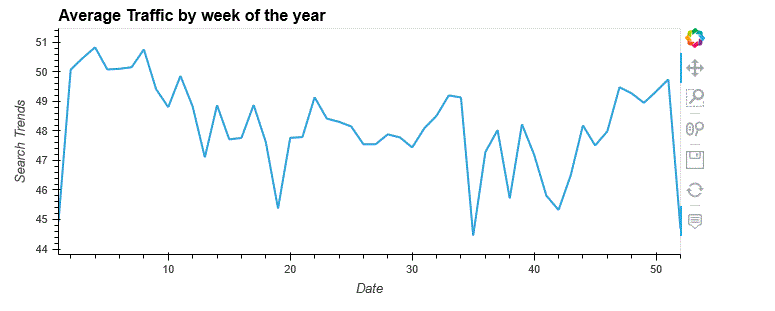

- Analyze the relationship of search traffic data to the stock price patterns.                    
Close Price:            
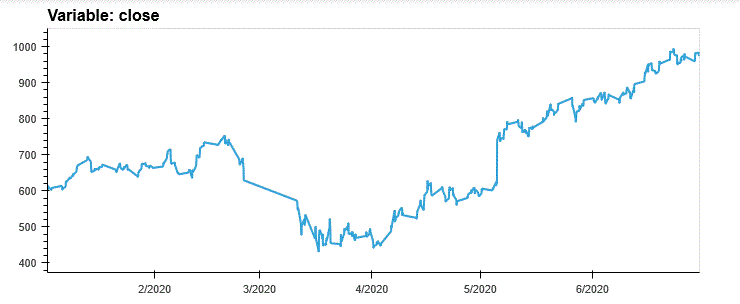
Company Search Traffic:                 

Correlation Table:                             
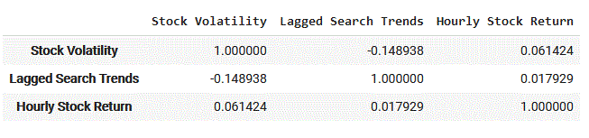

- Generate a time series model using Prophet that analyzes and forecasts patterns from the hourly search data.
Forecast Model:                        
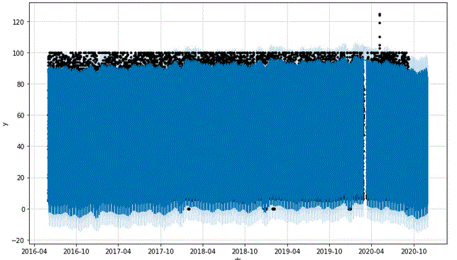                          
Forecast high, most likely, and worst case:                             
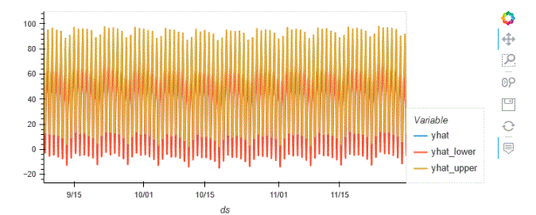                           
Forecast high, most likely, and worst case zoom in view:                    
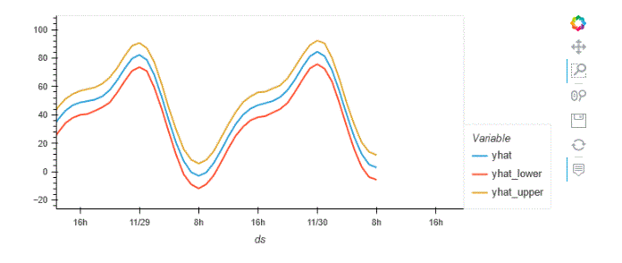                           
Search Traffic by Day of the Week:                        
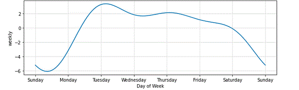                      
Search Traffic in Calendar Year:                         
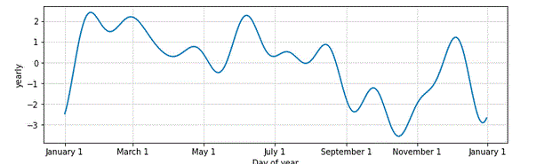                                 
Search Traffic by Hour:                                   
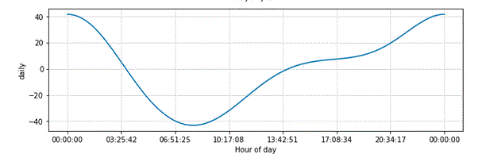                        

- Forecast the revenue by using time series models for total sales of the next quarter. This will benefit budget planning and guidance to analysts and investors.                                    
Revenue Forecast:
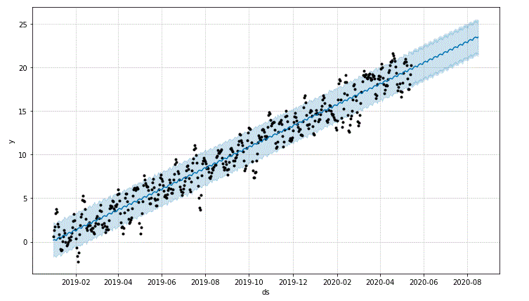
